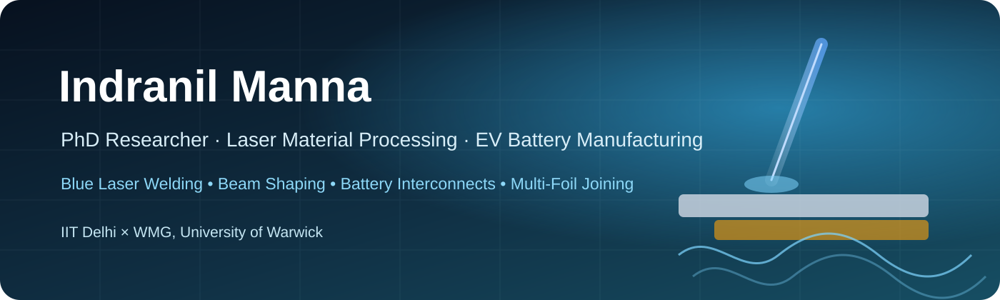

  

<h1 align="center">Indranil Manna</h1>

  <b>PhD Researcher · Mechanical Engineering · IIT Delhi</b> 
  Laser Material Processing · EV Battery Manufacturing · Advanced Joining

  
  
  

---

<table>
<tr>
<td width="70%" valign="top">

## 👨‍🔬 About Me

I am a **PhD researcher in Mechanical Engineering at the Indian Institute of Technology Delhi (IIT Delhi)** working on **laser-based joining and manufacturing technologies for electric-vehicle battery systems**.

My research connects **laser–material interaction, welding metallurgy, thermal modelling, electrical performance and manufacturing scalability** to develop robust joining solutions for next-generation battery packs.

I have also worked with the **Laser Beam Welding Group at WMG, University of Warwick**, on advanced laser technologies for challenging battery-material joining applications.

</td>
<td width="30%" align="center" valign="top">

</td>
</tr>
</table>

## 🔬 Research Focus

- 🔵 **Blue laser welding** of highly reflective conductive materials
- 🔋 **EV battery interconnects** and pouch-cell joining
- 🧵 **Multi-foil-to-tab welding** and defect mitigation
- 🌀 **Dynamic beam shaping / wobble welding**
- 🧲 **Interlayer-assisted Cu–Al dissimilar joining**
- 🌡️ **Transient thermal modelling** and laser heat-source development
- 🔁 **Reversible joining and laser-assisted soldering**
- ⚡ **Electrical contact resistance** and joint performance
- 🔍 **Microstructure, weld quality and mechanical characterisation**

## 🚀 Current Research Themes

### 🔵 Advanced laser welding for battery manufacturing
Developing laser-processing strategies for **copper and aluminium**, with emphasis on wavelength, beam profile, process stability, weld geometry and defect suppression.

### 🔋 Multi-foil-to-tab joining
Understanding how very thin foil stacks behave during joining and developing strategies to minimise **foil cutting, porosity, cracking and electrical-resistance variation**.

### 🌀 Beam shaping and process control
Studying how spatial beam distributions and wobble trajectories influence **melt-pool dynamics, heat flow and joint quality**.

### 🔁 Reversible battery interconnects
Exploring **bonding–debonding–rebonding** approaches for battery repair, reuse and circular manufacturing.

---

## 🧰 Research Toolkit

  
  
  
  
  

**Core areas:** laser processing · welding metallurgy · battery manufacturing · thermal modelling · microscopy · mechanical testing · electrical contact resistance · experimental design · scientific writing

---

## 📚 Research Topics You Will See Here

| Theme | Typical content |
|---|---|
| **Blue laser welding** | Beam absorption, process windows, weld morphology and defects |
| **Cu–Al joining** | Dissimilar-metal welding and interlayer optimisation |
| **Battery interconnects** | Mechanical strength and low-resistance joint design |
| **Multi-foil joining** | Thin-foil integrity, process stability and defect mitigation |
| **Laser soldering** | Reversible joining for battery repair and circularity |
| **Simulation** | Transient thermal models, Gaussian / shaped heat sources and COMSOL workflows |
| **Data analysis** | MATLAB scripts for beam profiles, process maps and experimental analysis |

## 📌 Planned Public Repositories

I am gradually organising research code and reusable tools into public repositories, including:

- **Laser beam profile visualisation** — Gaussian and super-Gaussian intensity distributions
- **Laser wobble path generation** — trajectory visualisation and parameter studies
- **COMSOL modelling notes** — thermal-model setup, solver strategies and post-processing
- **Battery welding data analysis** — process-window mapping and weld-quality analysis

---

## 🎯 Research Goal

To develop manufacturing technologies that make future battery systems:

<b>more reliable · more efficient · easier to manufacture · easier to repair · easier to recycle</b>

---

## 🤝 Collaboration

I am interested in collaborations involving **laser manufacturing, battery joining, advanced welding, process modelling and sustainable manufacturing**.

  <a href="https://scholar.google.com/citations?user=XSdDNNgAAAAJ">Google Scholar</a>
  ·
  <a href="https://www.researchgate.net/profile/Indranil-Manna-3">ResearchGate</a>
  ·
  <a href="https://www.linkedin.com/in/indranil-manna1998">LinkedIn</a>

<i>Engineering better joints for better batteries.</i>

